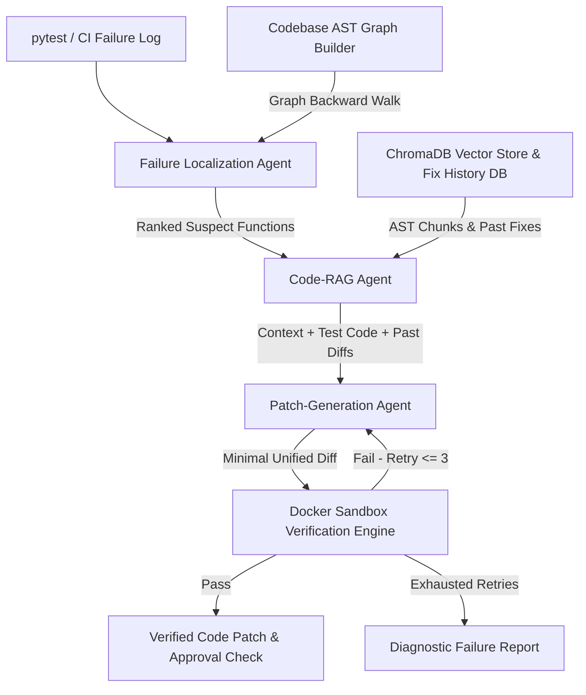

# Fixate: Self-Healing CI & Codebase Agent

> **Production-grade agentic AI system that detects failing builds/tests, localizes root causes via AST dependency graph traversal, generates minimal structured patches, and verifies fixes in isolated Docker sandboxes with bounded retries.**

---

## Core Engineering Principle

**No agent's claim of success is trusted until it is proven by real sandboxed execution.** LLM opinion is never the final source of truth — compiler output and test results are.

---

## System Architecture



---

## Core Agent Modules

### 1. Codebase Graph Builder (`fixate/graph/`)
- Parses target codebase AST symbols using an extensible `BaseLanguageParser` interface (Python `PythonASTParser` implemented, `JavaScriptTSParser` stub ready).
- Constructs a `networkx.DiGraph` connecting functions, classes, imports, and tests.
- Provides backward/forward call graph traversal utilities for localization and targeted test selection.

### 2. Failure Localization Agent (`fixate/localization/`)
- Parses pytest logs and stack traces into structured failure objects.
- Conducts deterministic AST dependency graph backward walks to isolate suspect functions (eliminating LLM candidate hallucination).
- Ranks top 1–3 candidate root causes using LLM plausibility reasoning.

### 3. Code-RAG Agent (`fixate/rag/`)
- Chunks codebases strictly by AST syntactic boundaries (functions and classes) to preserve code syntax and scope semantics.
- Indexes chunks in ChromaDB vector store.
- Maintains a **Fix History Store** (`fix_history.json`) recording past `(error signature -> verified diff)` pairs for few-shot retrieval.

### 4. Patch-Generation Agent (`fixate/patch/`)
- Produces minimal, structured, machine-applicable unified diffs enforcing Pydantic schema validation.
- Validates Python syntax of patched files before verification; retries diff formatting if syntax errors occur.

### 5. Sandbox Verification Engine (`fixate/verification/`)
- Spins up isolated Docker container execution environments (`python:3.11-slim` with `--network=none`).
- Applies diffs to fresh checkouts and runs targeted pytest test suites determined via dependency graph.
- Enforces a hard cap of **3 verification attempts**. If retries exhaust, generates an honest diagnostic failure report.

---

## Key Design Tradeoffs & Decisions

| Decision | Alternative Considered | Why Fixate Chose This Tradeoff |
| :--- | :--- | :--- |
| **AST-Boundary Chunking** | Naive character/line count chunking | Naive chunking cuts code arbitrarily across lines, splitting functions and scopes in half, corrupting AST syntax. AST chunking guarantees every chunk is a valid, self-contained symbol. |
| **AST Graph + LLM Hybrid Localization** | Pure LLM root-cause guessing | LLMs hallucinate non-existent files/functions when analyzing raw tracebacks. Graph backward walk guarantees the suspect candidate list originates strictly from static analysis. |
| **Bounded Retries (Max 3 Cap)** | Unbounded retry loops | Unbounded loops burn API tokens and get stuck in infinite error loops. 3 attempts provide optimal convergence while producing honest failure reports on exhaustion. |
| **Docker Container Isolation** | Subprocess execution | Subprocess execution allows AI-generated code to modify host files, environment variables, or network endpoints. Docker sandboxing ensures complete isolation. |

---

## Quickstart & Setup

### 1. Installation
```bash
git clone https://github.com/devam1912/Fixate.git
cd Fixate
pip install -e .
```

### 2. Environment Configuration
```bash
cp .env.example .env
# Set GEMINI_API_KEY for Google Gemini 2.5 Flash Free Tier
```

### 3. Running Unit Test Suite
```bash
pytest
```

### 4. Running Benchmark Evaluation Harness
```bash
python -m fixate.eval.harness
```

### 5. Running Web API & React SRE Dashboard
```bash
# Terminal 1: Backend FastAPI
uvicorn fixate.api.server:app --reload --port 8000

# Terminal 2: React Dashboard
cd dashboard
npm install
npm run dev
```

---

## Repository Structure

```
Fixate/
├── fixate/
│   ├── llm/            # Multi-LLM Swappable Provider Abstraction (Gemini & OpenAI/Ollama)
│   ├── graph/          # AST Codebase Graph Builder & Extensible Parsers
│   ├── localization/   # Failure Localization Agent & Traceback Parser
│   ├── rag/            # AST Code-RAG & Fix History Store
│   ├── patch/          # Patch Generator Agent & Unified Diff Applicator
│   ├── verification/   # Docker Sandbox Verification Engine & Bounded Retry Loop
│   ├── telemetry/      # Event Logger & Live SSE Stream Dispatcher
│   ├── safety/         # Human Approval Gate Safety Risk Evaluator
│   ├── orchestrator/   # Explicit State Machine Orchestrator Loop
│   ├── eval/           # Benchmark Scorecard & Test Cases
│   └── api/            # FastAPI Web Server & WebSocket Routers
├── dashboard/          # React + TypeScript + Tailwind CSS SRE Dashboard
├── sample_repos/       # Target Repositories (calculator_app, ecommerce_api, data_processor)
├── tests/              # Comprehensive Unit Test Suite
├── Dockerfile.sandbox  # Isolated Sandbox Container Environment
└── docs/
    └── DEPLOYMENT.md   # Cloud Docker Sandbox Deployment Strategy
```
