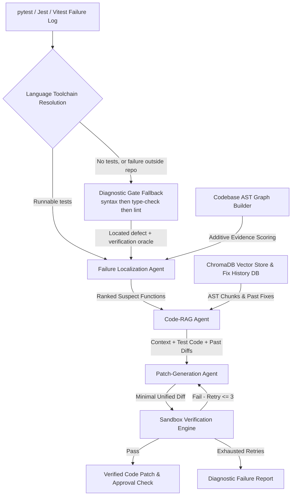

# Fixate: Self-Healing CI & Codebase Agent

> **Production-grade agentic AI system that detects failing builds/tests across Python and JavaScript/TypeScript repositories, localizes root causes via AST dependency graph analysis, generates minimal structured patches, and verifies fixes in isolated Docker sandboxes with bounded retries.**

**Live app:** [https://fixate-jaab.onrender.com/](https://fixate-jaab.onrender.com/)

---

## Core Engineering Principle

**No agent's claim of success is trusted until it is proven by real sandboxed execution.** LLM opinion is never the final source of truth — compiler output and test results are.

---

## System Architecture



---

## Core Agent Modules

### 1. Codebase Graph Builder (`fixate/graph/`)
- Parses target codebase AST symbols using an extensible `BaseLanguageParser` interface — Python, JavaScript/TypeScript, and practical C++ parsers are supported.
- Constructs a `networkx.DiGraph` connecting functions, classes, imports, and tests.
- Provides backward/forward call graph traversal utilities for localization and targeted test selection.

### 2. Failure Localization Agent (`fixate/localization/`)
- Parses pytest, Jest, and Vitest logs and stack traces into structured failure objects.
- Scores **every** non-test symbol against **all** traceback evidence at once — error site (100), stack frames (30–50, weighted by depth), names in the traceback (25), failing file (15), call-graph adjacency (10) — rather than returning whichever of several strategies first produces a non-empty list.
- An LLM re-ranks the top 15 candidates and up to 5 are carried forward. Candidates originate strictly from static analysis, so the model cannot introduce files or functions that do not exist. With no live model, static ranking stands and is honestly labelled `ranking_source="static"`.

### 3. Code-RAG Agent (`fixate/rag/`)
- Chunks codebases strictly by AST syntactic boundaries (functions and classes) to preserve code syntax and scope semantics.
- Indexes chunks in ChromaDB vector store.
- Maintains a **Fix History Store** (`fix_history.json`) recording past `(error signature -> verified diff)` pairs for few-shot retrieval.

### 4. Patch-Generation Agent (`fixate/patch/`)
- Produces minimal, structured, machine-applicable unified diffs enforcing Pydantic schema validation.
- **Requires a live model.** With no provider configured it raises `LLMUnavailableError` rather than returning placeholder output — earlier versions emitted schema-shaped simulated patches that flowed downstream and were applied to real source files.
- The applicator rejects any diff that fails to apply *or* leaves the file byte-identical, so a hallucinated diff can never be credited with a repair.

### 5. Sandbox Verification Engine (`fixate/verification/`)
- Runs each attempt against a **fresh copy** of the repository, in an isolated Docker container (`--network=none`, 512 MB cap) or a subprocess fallback when Fixate is itself containerized.
- A patch that fails to apply never reaches the sandbox, and the file is independently confirmed changed on disk before any check runs.
- Enforces a hard cap of **3 verification attempts**, feeding each failure back to the model. If retries exhaust, generates an honest diagnostic failure report.

### 6. Language Toolchains & Diagnostic Gates (`fixate/languages/`)
- One `LanguageToolchain` per supported language (Python, JavaScript/TypeScript, C++), owning failure parsing, test-command construction, dependency installation, and environment setup.
- Incident routing is driven by the **failing log**, which names the runner that actually broke — this is what makes a mixed-language repository tractable: one repo, but one language per incident.
- Repositories with **no runnable tests** fall back to diagnostic gates, tried most-conclusive first: `python-syntax` → `ruff` → `pyflakes`, or `js-syntax` → `tsc` → `eslint`. The selected gate becomes the verification oracle, so the same checker that found the problem must later agree it is gone — and the total diagnostic count must not grow.

### 7. Verification Oracles (`fixate/verification/oracles.py`)
- `TestSuiteOracle` — the repository's own tests must pass. Strongest evidence, and the default whenever tests exist.
- `DiagnosticGateOracle` — a checker that reported a specific problem must stop reporting it, **without introducing new ones**. Otherwise "fixing" an undefined name by deleting the function that uses it would count as a repair.

---

## Key Design Tradeoffs & Decisions

| Decision | Alternative Considered | Why Fixate Chose This Tradeoff |
| :--- | :--- | :--- |
| **AST-Boundary Chunking** | Naive character/line count chunking | Naive chunking cuts code arbitrarily across lines, splitting functions and scopes in half, corrupting AST syntax. AST chunking guarantees every chunk is a valid, self-contained symbol. |
| **AST Graph + LLM Hybrid Localization** | Pure LLM root-cause guessing | LLMs hallucinate non-existent files/functions when analyzing raw tracebacks. Graph backward walk guarantees the suspect candidate list originates strictly from static analysis. |
| **Bounded Retries (Max 3 Cap)** | Unbounded retry loops | Unbounded loops burn API tokens and get stuck in infinite error loops. 3 attempts provide optimal convergence while producing honest failure reports on exhaustion. |
| **Docker Container Isolation** | Subprocess execution | Subprocess execution allows AI-generated code to modify host files, environment variables, or network endpoints. Docker sandboxing ensures complete isolation. |
| **Hard-Fail on Missing LLM** | Simulated / placeholder patches | Placeholder output previously flowed downstream and was applied to real files, disguising "no model configured" as "the model tried and failed". Deterministic patches belong in tests, via a fake provider — never in the production path. |
| **Additive Evidence Scoring** | First-non-empty strategy cascade | A cascade let a weak signal (every symbol in the repository) win outright whenever the strong signals came up empty, with nothing downstream able to tell the two cases apart. |
| **Token-Based Risk Matching** | Raw substring matching | Substring matching made every identifier containing "card" (`discard`, `cardinality`, `wildcard`) look like a payment change. A gate that fires on routine patches trains operators to approve without reading, costing exactly the scrutiny it exists to buy. |

---

## Quickstart & Setup

### 1. Installation
```bash
git clone https://github.com/devam1912/Fixate.git
cd Fixate
pip install -e .
```

### 2. Environment Configuration
```bash
cp .env.example .env
# Set GEMINI_API_KEY for Google Gemini 2.5 Flash Free Tier
```

### 3. Running Unit Test Suite
```bash
pytest
```

### 4. Running Benchmark Evaluation Harness
```bash
python -m fixate.eval.harness
```

### 5. Running Web API & React SRE Dashboard
```bash
# Terminal 1: Backend FastAPI
uvicorn fixate.api.server:app --reload --port 8000

# Terminal 2: React Dashboard
cd dashboard
npm install
npm run dev
```

### 6. Running the Full Stack via Docker
```bash
docker-compose up --build
```
`--build` is required after local Python changes — the daemon will otherwise keep serving the previously baked image.

---

## Repository Structure

```
Fixate/
├── fixate/
│   ├── llm/            # Multi-LLM Swappable Provider Abstraction (Gemini, OpenAI-compatible, Ollama)
│   ├── graph/          # AST Codebase Graph Builder, Python & TypeScript Parsers, Traversal
│   ├── languages/      # Per-Language Toolchains, Diagnostic Gates & Resolution Registry
│   ├── localization/   # Failure Localization Agent & Traceback Parsers
│   ├── rag/            # AST Code-RAG, ChromaDB Vector Store & Fix History Store
│   ├── patch/          # Patch Generator Agent & Unified Diff Applicator
│   ├── verification/   # Bounded Retry Loop, Verification Oracles, Targeted Runner & Sandbox
│   ├── telemetry/      # Event Logger & Live SSE / WebSocket Stream Dispatcher
│   ├── safety/         # Human Approval Gate Safety Risk Evaluator
│   ├── orchestrator/   # Explicit State Machine Orchestrator Loop
│   ├── eval/           # Benchmark Harness, Cases & Scorecard Metrics
│   ├── api/            # FastAPI Web Server, Routes & Streaming Endpoints
│   ├── errors.py       # Typed Pipeline Errors Carrying Stage & Remedy
│   ├── paths.py        # Centralized Path Resolution
│   └── sample_repos.py # Sample Repository Registry & Benchmark Fixtures
├── dashboard/          # React + TypeScript + Tailwind CSS repair dashboard (Vite)
├── sample_repos/       # Target Repositories (calculator_app, ecommerce_api, data_processor,
│                       #                      enterprise_app, ts_cart_app)
├── tests/              # Comprehensive Unit Test Suite (11 modules + shared fakes)
├── scripts/            # Benchmark Log Regeneration Utilities
├── Dockerfile          # Application Container
├── Dockerfile.sandbox  # Isolated Sandbox Container Environment
├── docker-compose.yml  # Full-Stack Local Orchestration
└── docs/
    └── DEPLOYMENT.md   # Cloud Docker Sandbox Deployment Strategy
```
