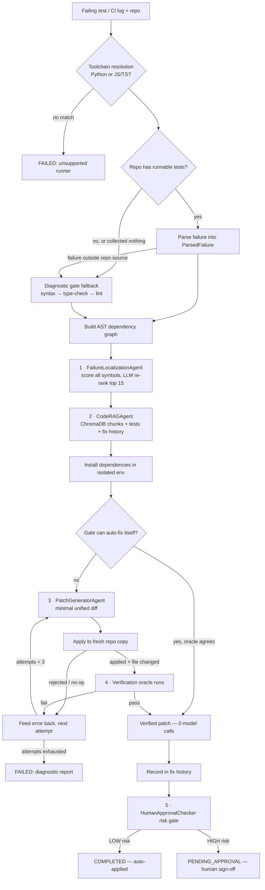

# Fixate — Project Summary & Q&A

> **Fixate is a self-healing CI/codebase agent.** Given a failing build or test log and a repository, it localizes the root cause through AST dependency-graph analysis, retrieves relevant code and prior fixes, asks an LLM for a minimal unified-diff patch, and then *proves* the patch in an isolated sandbox before anything is applied. If it cannot prove a fix within a bounded number of attempts, it says so honestly and hands over a diagnostic report.

---

## 1. The Core Principle

**No agent's claim of success is trusted until it is proven by real sandboxed execution.**

LLM opinion is never the final source of truth — compiler output, test results, and checker diagnostics are. Every design decision in the codebase follows from this, and several of the guardrails exist because the engine was previously caught claiming credit for repairs it never made ("placebo healing").

---

## 2. What the System Actually Does

1. An operator (or CI) supplies a repository — a GitHub URL, a local path, or a bundled sample repo — plus the failing test/build log.
2. Fixate identifies which **language toolchain** the failure belongs to (Python or JavaScript/TypeScript) from the log itself.
3. It builds a **NetworkX AST dependency graph** of the codebase and scores every symbol against all evidence in the traceback.
4. It retrieves supporting context from a **ChromaDB vector index** (AST-boundary chunks) plus a **fix-history store** of past `(error signature → verified diff)` pairs.
5. It asks a live LLM for a **minimal unified diff**, applies it to a throwaway copy of the repo, and runs the **verification oracle**.
6. On success, the patch is recorded in fix history and passed through a **risk gate** that decides whether it may auto-apply or needs human sign-off.
7. On exhaustion, it emits an **honest failure report** naming what was tried and what to do next.

Every state transition emits a telemetry event, streamed live over SSE/WebSocket to a React dashboard.

---

## 3. Repository Layout

```
Fixate/
├── fixate/
│   ├── llm/            # Swappable providers: Gemini, OpenAI-compatible, Ollama + rate limiter
│   ├── graph/          # AST graph builder, Python parser, TypeScript (tree-sitter) parser, traversal
│   ├── languages/      # Per-language toolchains, diagnostic gates, registry
│   ├── localization/   # Failure localization agent + traceback parsers
│   ├── rag/            # AST chunker, ChromaDB vector store, fix-history store, RAG agent
│   ├── patch/          # Patch generator agent, unified-diff applicator, Pydantic schemas
│   ├── verification/   # Bounded retry loop, verification oracles, targeted test runner, sandbox
│   ├── safety/         # Risk classification / human approval gate
│   ├── orchestrator/   # Explicit state-machine engine
│   ├── telemetry/      # Event logger + live SSE/WebSocket dispatcher
│   ├── eval/           # Benchmark harness, cases, scorecard metrics
│   ├── api/            # FastAPI server, routes, streaming endpoints
│   ├── errors.py       # Typed pipeline errors carrying stage + remedy
│   └── paths.py        # Centralized path resolution
├── dashboard/          # React + TypeScript + Tailwind SRE dashboard (Vite)
├── sample_repos/       # 5 target repos with intentional bugs
├── tests/              # 11 unit-test modules + shared fakes
├── scripts/            # Benchmark log regeneration
└── docs/DEPLOYMENT.md
```

---

## 4. Key Design Tradeoffs

| Decision | Alternative | Why this choice |
| :--- | :--- | :--- |
| **AST-boundary chunking** | Fixed character/line chunks | Naive chunking splits functions mid-body, corrupting syntax and scope. AST chunks are always valid self-contained symbols. |
| **Graph + LLM hybrid localization** | Pure LLM root-cause guessing | LLMs hallucinate files and functions that don't exist. The candidate set comes strictly from static analysis; the LLM only re-ranks it. |
| **Additive evidence scoring** | First-non-empty strategy cascade | The old cascade let a weak signal (every symbol in the repo) win outright when strong signals were empty, with nothing downstream able to tell the difference. |
| **Bounded retries (max 3)** | Unbounded retry loop | Unbounded loops burn tokens and get stuck. Three attempts converge in practice and produce an honest report on exhaustion. |
| **Sandboxed execution** | In-place subprocess on the repo | Untrusted, AI-modified code must not touch the host or the working tree. Each attempt runs on a fresh copy; the working tree is only updated after a pass. |
| **Hard-fail on missing LLM** | Simulated/placeholder patches | Placeholder output previously flowed downstream and got applied to real files, disguising "no model configured" as "the model tried and failed". |
| **Token-based risk matching** | Raw substring matching | Substrings made `discard`, `cardinality`, and `wildcard` all look like payment changes. A gate that fires on routine patches trains operators to rubber-stamp. |

---

# Questions & Answers

## Q1. How many agents are used, and what does each one do?

**Five agents plus one orchestrator.** Only two of them call an LLM; the rest are deterministic by design.

| # | Agent | Module | Uses LLM? | Responsibility |
| :-- | :--- | :--- | :--- | :--- |
| 1 | **FailureLocalizationAgent** | `fixate/localization/agent.py` | Yes (re-ranking only) | Scores every non-test symbol in the AST graph against all traceback evidence, then has the LLM re-rank the top 15. Falls back to static ranking — labelled as such — when no model is live. |
| 2 | **CodeRAGAgent** | `fixate/rag/agent.py` | Embeddings only | Indexes the repo as AST chunks in ChromaDB, retrieves related code, related tests, and prior verified diffs for the suspect. |
| 3 | **PatchGeneratorAgent** | `fixate/patch/agent.py` | **Yes (required)** | Builds the repair prompt and asks for a minimal unified diff. Raises `LLMUnavailableError` rather than producing anything patch-shaped without a real model. |
| 4 | **VerificationAgent** | `fixate/verification/agent.py` | No | Runs the bounded generate → apply → test → learn loop against a fresh repo copy each attempt. Owns all the anti-placebo guardrails. |
| 5 | **HumanApprovalChecker** (aliased `SafetyChecker`) | `fixate/safety/approval.py` | No | Classifies a *verified* patch as HIGH or LOW risk and decides whether it can auto-apply. |
| — | **OrchestrationEngine** | `fixate/orchestrator/engine.py` | No | Not an agent — the explicit state machine that sequences the five and converts any stage failure into an operator-facing summary. |

Supporting (non-agent) components: `CodebaseGraphBuilder`, `TargetedTestRunner`, `DockerSandboxManager`, `PatchApplicator`, `FixHistoryStore`, `TelemetryLogger`, and the language toolchains.

---

## Q2. What is the workflow graph?



---

## Q3. What are the orchestrator's states?

Nine, defined in `OrchestrationState`:

`IDLE → LOCALIZING → RETRIEVING → PATCHING → VERIFYING → CHECKING_SAFETY → COMPLETED`

with two alternate terminals: **`PENDING_APPROVAL`** (verified but risky) and **`FAILED`** (any stage that genuinely cannot proceed). Every transition emits a telemetry event, so the dashboard renders progress live rather than only showing the terminal summary.

---

## Q4. Why does localization run *before* the LLM availability check?

Deliberate ordering. An incident with no model configured still tells the operator **which symbol is implicated and why** — which is most of the diagnostic value — instead of refusing at the door. The pipeline stops at the first stage that genuinely cannot proceed; it never substitutes invented output to reach a terminal state.

---

## Q5. How does localization rank suspects?

Additive scoring over **all** evidence at once (not a first-match cascade), weighted by how directly each signal implicates a symbol:

| Points | Signal |
| :-- | :--- |
| 100 | Symbol encloses the exact error site (`file:line` from the runner) |
| 30–50 | Symbol encloses a stack frame — deeper frames weigh more, being closer to the raise |
| 25 | Symbol name appears in the traceback text |
| 15 | Symbol is defined in the failing file |
| 10 | Symbol is an immediate call-graph neighbour of anything already implicated |
| 5 | Symbol is an executable function/method (a bug lives in a body, not a class header) |

Test symbols are excluded throughout. The top 15 candidates go to the LLM for re-ranking; up to 5 suspects are carried forward. If the LLM is unavailable or returns nothing usable, static order stands and `ranking_source` is honestly labelled `"static"` rather than `"llm"`.

---

## Q6. How many verification attempts, and what happens on each one?

**Hard cap of 3** (`MAX_VERIFICATION_ATTEMPTS = 3`). Each attempt:

1. Copies the repo to a fresh temp workspace (`.git` excluded) — so a failed attempt cannot leave debris that contaminates the next.
2. Builds a `PatchRequest` containing the suspect source, the failing test's source, retrieved context, filtered prior diffs, the previous attempt's error, and the actual proof requirement.
3. Generates a patch — or aborts immediately if no live LLM (retrying a missing model wastes minutes and buries the real cause).
4. Applies the diff. **If it does not apply, the sandbox never runs.**
5. Re-reads the file and confirms it actually changed on disk — deliberate redundancy behind the applicator's own no-op check.
6. Runs the oracle. On pass, the workspace is copied back over the real repo. On fail, the output is fed back as `previous_attempt_error`.
7. The temp workspace is always destroyed in a `finally` block.

On exhaustion: a Markdown failure report listing every attempt, its diff, its output, and a specific recommendation derived from the *pattern* of outcomes.

---

## Q7. What are the possible attempt outcomes?

`AttemptOutcome` has five values:

- **`passed`** — the oracle was satisfied.
- **`autofixed`** — the checker fixed its own diagnostic before the loop ran; zero model calls.
- **`check_failed`** — patch applied cleanly, oracle still unsatisfied.
- **`patch_rejected`** — the diff didn't apply, or left the file byte-identical.
- **`generation_failed`** — the model returned nothing usable.

The failure report's recommendation branches on these. All-`patch_rejected` means the model couldn't quote the source accurately, which usually means localization pointed at the wrong symbol. All-`check_failed` against a test oracle means the defect probably isn't confined to the localized symbol, or the test depends on external state the sandbox doesn't reproduce.

---

## Q8. What is "placebo healing" and how is it prevented?

Observed in production: the LLM hallucinated a typo (`self.nex`) that didn't exist in the file, so the patch silently failed to apply. The sandbox re-ran the *unmodified* file, an unrelated flaky network call happened to succeed, and the engine marked the incident `COMPLETED` — taking credit for a repair it never made.

Three layers now prevent this:

1. **`PatchApplicator`** compares patched output against the original and rejects byte-identical results outright.
2. **`VerificationAgent`** skips the sandbox entirely when application fails, and independently re-reads the file to confirm it changed.
3. **`DiagnosticGateOracle`** checks not just that the target diagnostic disappeared, but that the total diagnostic count didn't grow — so "fixing" an undefined name by deleting the function that uses it doesn't count.

Re-tested against the same flaky repo, all three hallucinated patches were caught, tests were never run, and the incident was honestly marked `FAILED`.

---

## Q9. What if a repository has no tests at all?

It falls back to **diagnostic gates** — objective checkers tried most-conclusive first:

- **Python:** `PythonSyntaxGate` (every file compiles) → `RuffGate` (lint rules) → `PyflakesGate`
- **JavaScript/TypeScript:** `JavaScriptSyntaxGate` (every file parses) → `TypeScriptCompilerGate` (project type-checks) → `EslintGate`

The selected gate becomes the **verification oracle** — the same checker that found the problem is the one that must later agree it's gone. This also covers the case where the reported failure points *outside* the repo (into `node_modules`, a venv, or the runner's own source), since that isn't this repository's defect to repair.

Additionally, if the gate can fix its own diagnostic (many formatting and import rules have exactly one accepted form), it does — and the fix still has to satisfy the oracle to be accepted. Those incidents report **zero** attempts, which the eval harness treats as a first-pass success rather than a missing value.

---

## Q10. What are the two verification oracles?

Both implement the `VerificationOracle` protocol (`verify(workspace) → SandboxRunResult`, plus `describe()`):

| Oracle | Proves | Used when |
| :--- | :--- | :--- |
| **`TestSuiteOracle`** | "the failing test passes" | Default — whenever the repo has runnable tests |
| **`DiagnosticGateOracle`** | "\<gate's claim\> (verified by \<gate\>)" | The repo has no tests, or the failure lies outside its source |

The oracle's `describe()` string propagates into the patch prompt, the attempt feedback, the failure report, and the summary's `verified_by` field — so nothing ever says "tests passed" when a linter was the actual judge.

---

## Q11. How does the sandbox achieve isolation?

Primary path: a Docker container (`fixate-sandbox:latest`) with `--network=none`, a 512 MB memory limit, the workspace bind-mounted at `/workspace`, and forced cleanup after the run.

**Subprocess fallback**, used when Docker is unavailable — and *deliberately forced* when Fixate itself is containerized (detected via `/.dockerenv`). The reason is a real Docker-in-Docker bug: the containerized backend cloned repos into its own `/tmp`, then asked the *host* daemon to bind-mount that path. The host looked for it on the Windows filesystem, found nothing, and silently mounted an empty directory — so pytest collected 0 items and exited 5, three times per incident. Since the backend container already provides isolation, dropping to a subprocess resolves it cleanly.

Independently of the sandbox mechanism, every attempt runs against a **fresh copy** of the repository, never the original.

---

## Q12. How does the RAG layer work?

- **Chunking** is on AST boundaries only — one chunk per function or class, never a fixed line count, so every chunk is a syntactically valid self-contained symbol.
- **Vector store** is ChromaDB with Gemini embeddings (`gemini-embedding-2`, 3072 dims by default), with batching, token truncation, rate limiting, and exponential backoff on quota errors.
- **Partition key** is derived from the git origin URL, not the directory path. Fixate clones each incident into a fresh randomly-named temp dir, so keying on path would mint a new partition per run and grow the index without bound — while keying on the directory *name* would collapse every clone into one partition and reintroduce cross-repository contamination.
- **Three query framings** are issued and merged (suspect + error, error alone, suspect alone), because one string can't serve both "find code like this symbol" and "find code like this error".
- **Retrieval is best-effort.** A vector-store outage logs a warning and yields empty context; the patch generator then prompts from the suspect source alone. It never pads results with unrelated chunks — prompt quality degrades faster from irrelevant context than from missing context.
- **Caps:** 5 code chunks, 3 test chunks. The suspect's own source is excluded (it's already in the prompt).

---

## Q13. What is the fix-history store?

`fix_history.json` — a persistent record of `(exception type, exception message, failing symbol) → verified diff` pairs, used for few-shot retrieval on later incidents.

Two rules keep it clean:

1. **Only verified patches are recorded.** Writing unproven diffs would poison retrieval context for every future incident.
2. **Prior diffs are filtered by filename** before reaching the prompt. A diff touching an unrelated module reads to the model as an instruction to make similar edits *here*, which historically produced patches aimed at the wrong file.

---

## Q14. How does the safety gate decide?

`HumanApprovalChecker` runs *after* verification, so it isn't asking "is this correct?" — it's asking **"is this code where a passing test is sufficient evidence?"** For authentication, payments, and schema migrations it isn't: failures there are silent, expensive, and often invisible to the suite that just went green.

Two signal types:

- **Token matching** on the file path, symbol name, and **added lines only** — against ~55 keywords across auth/secrets (`token`, `jwt`, `oauth`, `credential`, `rbac`…), money movement (`payment`, `refund`, `payout`, `ledger`…), and destructive data ops (`migration`, `drop`, `truncate`, `purge`…). Matching is token-based, not substring: `login_user` yields `{login, user}` while `discard` stays whole and never matches `card`.
- **Regex patterns** on added lines that describe an *action* a keyword can't capture: `DROP TABLE`, `DELETE FROM`, `shutil.rmtree`, `os.remove`, `subprocess.*`, `eval(`/`exec(`, `verify=False`, `# nosec` / `# type: ignore`.

Removed lines are ignored — judging a patch by what it deletes inverts the signal. Any match → `HIGH` risk → state becomes `PENDING_APPROVAL` instead of `COMPLETED` (when `human_approval_required=True`).

---

## Q15. Which languages are supported, and how is the language chosen?

Two toolchains, registered in deterministic order in `fixate/languages/registry.py`:

1. **`PythonToolchain`** — `ast`-based parser, pytest runner, per-repo `.fixate_venv` for dependency isolation.
2. **`JavaScriptToolchain`** — tree-sitter parser (pure-Python wheels, no Node needed to *parse*), Jest/Vitest runner detection, `node_modules` install with lifecycle scripts disabled.

Resolution precedence follows how much each signal narrows the question:

1. **The failing log** — names the runner that actually broke. This is what makes mixed-language repos tractable: one repo, but one language per incident.
2. **The suspect file's extension** — names the language being repaired.
3. **Repository detection** (manifests, then extension scanning) — last resort.

---

## Q16. Which LLM providers are supported?

Swappable behind `BaseLLMProvider`, selected via the `FIXATE_LLM_PROVIDER` env var:

| Provider | Class | Notes |
| :--- | :--- | :--- |
| `gemini` / `google` | `GeminiProvider` | Default; free-tier oriented |
| `openai` / `gpt` | `OpenAICompatibleProvider` | Any OpenAI-compatible endpoint |
| `ollama` / `local` | `OpenAICompatibleProvider` | Points at `OLLAMA_BASE_URL`, default model `llama3` |

Every provider exposes an **`is_live`** flag. This is the single check that distinguishes "a model tried and failed" from "there was no model" — localization degrades gracefully to static ranking when it's false, while patch generation refuses outright.

---

## Q17. How is the system evaluated?

`EvalHarnessRunner` runs a registered benchmark suite against `OrchestrationEngine` and emits an `EvalScorecard`.

**7 benchmark cases** across 5 sample repos and 6 bug categories:

| Case | Repo | Category |
| :--- | :--- | :--- |
| `case_calc_01` | calculator_app | logic_error |
| `case_calc_02` | calculator_app | zero_division |
| `case_ecom_01` | ecommerce_api | type_error |
| `case_data_01` | data_processor | off_by_one |
| `case_data_02` | data_processor | null_reference |
| `case_ent_01` | enterprise_app | logic_error |
| `case_ts_01` | ts_cart_app | logic_error (TypeScript) |

**Metrics:** localization accuracy %, first-attempt success %, overall fix rate %, average attempts per case, average execution time, estimated token cost.

Two honesty properties worth noting:

- **`pytest_log` is left unset by design.** The harness runs each repository's *own* suite and uses whatever the runner actually printed. Hand-written logs drift from the code they claim to describe — one previously asserted `80.0 == 80.0`, which would have *passed* — and scoring localization against a traceback no test emitted measures nothing.
- **`load_scorecard()` returns `None`** when no run has happened, so the dashboard shows "not yet measured" rather than numbers nobody produced.

---

## Q18. What does the API expose?

FastAPI, all routes under `/api`:

| Method | Route | Purpose |
| :--- | :--- | :--- |
| `GET` | `/api/health` | Health check |
| `GET` | `/api/sample-repos` | List bundled target repos |
| `GET` | `/api/graph` | AST dependency graph nodes + edges for visualization |
| `POST` | `/api/incident/trigger` | Run an incident synchronously, return the terminal summary |
| `POST` | `/api/incident/start` | Start in the background, return `incident_id` immediately |
| `GET` | `/api/incident/{id}` | Fetch a completed incident's summary |
| `GET` | `/api/eval` | Last recorded scorecard (or "not yet measured") |
| `POST` | `/api/eval/run` | Run the benchmark suite |
| `GET` | `/sse/{incident_id}` | Server-Sent Events telemetry stream |
| `WS` | `/ws/{incident_id}` | WebSocket telemetry stream |

The `incident_id` can be supplied by the caller *before* the run begins, so a client subscribes to the stream first and sees every stage — not just the terminal summary. The built dashboard is served as static files when `dashboard/dist` exists, with unmatched `/api` and `/ws` paths correctly returning 404 rather than a `200 null`.

---

## Q19. What does the dashboard show?

React + TypeScript + Tailwind (Vite), four tabs:

- **Live** — `PipelineFlow`, the real-time stage-by-stage pipeline view driven by the telemetry stream, plus `DiffViewer` for the verified patch.
- **Graph** — `GraphViewer`, the AST dependency graph.
- **History** — `IncidentHistory`, past incidents and outcomes.
- **Eval** — `EvalCharts`, benchmark scorecard visualizations.

Three input modes: a GitHub URL, a bundled sample repo, or a local path — with optional custom failure log and environment variables.

---

## Q20. How is telemetry delivered?

`TelemetryLogger` records structured `AgentTelemetryEvent` objects (incident ID, agent name, action, input, output, status, details) and supports subscribers. The API wires a single process-wide logger to `EventStreamDispatcher`, so every `log_event` call fans out to connected SSE and WebSocket clients. Events are also persisted to `telemetry_logs/`.

One subtle but important detail: the `FAILED` transition is emitted from a **single place** in the engine rather than at each call site. Live subscribers close their stream on a terminal transition — without one, a failed incident leaves the dashboard spinning on keepalives forever even though the run has finished.

---

## Q21. What is the test suite?

11 pytest modules under `tests/`, plus `fakes.py` providing a fake LLM provider:

`test_api.py` · `test_diagnostics.py` · `test_eval_harness.py` · `test_graph_builder.py` · `test_languages.py` · `test_llm_providers.py` · `test_localization.py` · `test_orchestrator.py` · `test_patch.py` · `test_rag.py` · `test_verification.py`

Deterministic patches still have a legitimate place — in tests, supplied through the fake provider. They do not belong in the production path, where their only effect is to disguise "there was no model" as "the model tried and failed".

---

## Q22. How do I run it?

**Install:**
```bash
pip install -e .
```

**Configure** — copy `.env.example` to `.env` and set `GEMINI_API_KEY` (or the provider of your choice via `FIXATE_LLM_PROVIDER`).

**Unit tests:**
```bash
pytest
```

**Benchmark harness:**
```bash
python -m fixate.eval.harness
```

**Backend:**
```bash
uvicorn fixate.api.server:app --reload --port 8000
```

**Dashboard:**
```bash
cd dashboard && npm install && npm run dev
```

**Full stack via Docker:**
```bash
docker-compose up --build
```

Note: local Python changes do not propagate into a running compose environment — `--build` is required to force the daemon to ingest them.

---

## 5. Note on Documentation Drift

`README.md` is slightly behind the current code in two places: it describes `JavaScriptTSParser` as a stub (it is now a working tree-sitter parser in `fixate/graph/ts_parser.py`, and `js_stub_parser.py` has been deleted), and it lists three sample repos where there are now five. The `fixate/languages/` package, the diagnostic-gate fallback, and `fixate/verification/oracles.py` are all newer than the README and not described there.
